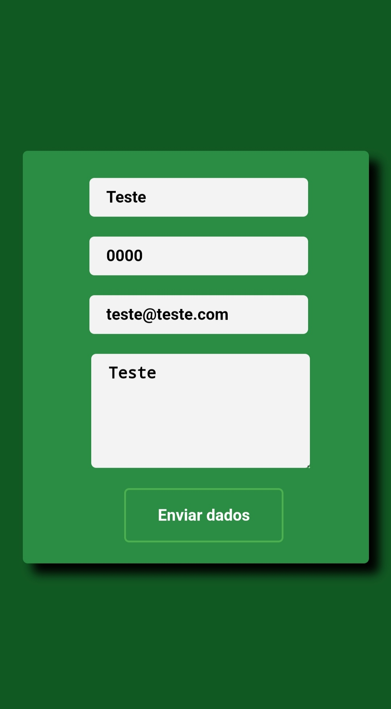
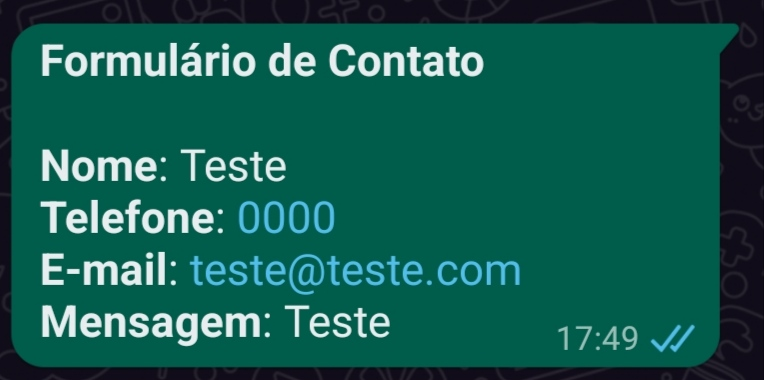

<h1 align="center">Formulário de contato</h1>
<p align="center">Um formulário que envia as informações para o whatsapp.</p> 

# 👨🏻‍💻 O que usei
  
=
# 💻 Tela do projeto
<p align="center">
 <br>

</p>

# 🚀 Comandos de instalação
```
git clone https://github.com/matheusnsilvab/Formulario-de-contato.git
cd Formulario-de-contato
```